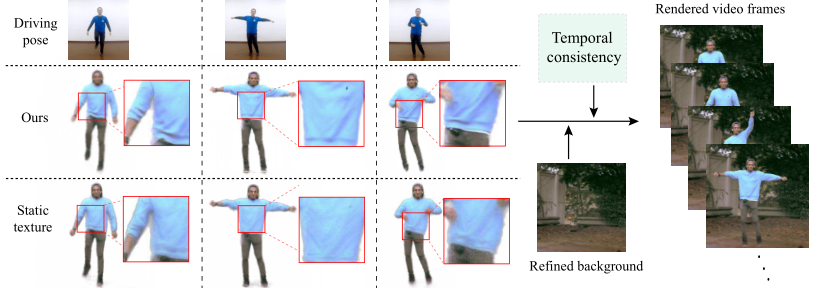

# Robust pose transfer with dynamic details using neural video rendering framwork

### [Paper](https://ieeexplore.ieee.org/document/9756251) | [Video](https://www.bilibili.com/video/BV1y64y1C7ge/)<br>


## Abstract
Pose transfer of human videos aims to generate a high-fidelity video of a target person imitating actions of a source person. A few studies have made great progress either through image translation with deep latent features or neural rendering with explicit 3D features. 
However, both of them rely on large amounts of training data to generate realistic results, and the performance degrades on more accessible Internet videos due to insufficient training frames.
In this paper, we demonstrate that the dynamic details can be preserved even when trained from short monocular videos.
Overall, we propose a neural video rendering framework coupled with an image-translation-based dynamic details generation network (D$^2$G-Net), which fully utilizes both the stability of explicit 3D features and the capacity of learning components.
To be specific, a novel hybrid texture representation is presented to encode both the static and pose-varying appearance characteristics, which is then mapped to the image space and rendered as a detail-rich frame in the neural rendering stage.
Through extensive comparisons, we demonstrate that our neural human video renderer is capable of achieving both clearer dynamic details and more robust performance.

## Environment 
```
conda create -n JittorEnv python=3.8 
conda activate JittorEnv
```
First, install [jittor](https://github.com/Jittor/jittor) 

There are also some other dependencies
<details>
<summary> click to expand </summary>

- opencv-python
- scikit-image
- scipy
- dominate
- tensorflow (for tensorboard)

</details>

## Dataset
The data used in this code can be any single-person video. It should be organized like this:
```
dataName
├── bg.jpg
├── dataName (this is video frames folder)
├── densepose
├── flow
├── flow_inv
├── LaplaceProj (this is the 3D pose label)
├── mask
├── openpose_json
└── texture.jpg
```
The bg.jpg is the background image extracted with [inpainted apporach](https://github.com/JiahuiYu/generative_inpainting) from the video (or your can even use a common video frame). It will update during the training process.

The densepose is extracted by the [Densepose](https://github.com/facebookresearch/detectron2/tree/master/projects/DensePose).

The flow and flow_inv is the forward and backward flow calclulated by [FlowNet2](https://github.com/NVIDIA/flownet2-pytorch).

The LaplaceProj contains the 3D pose labels explained in this [paper](https://arxiv.org/abs/2003.13510). It's optional in our approach.

The mask is extracted by [Human-Segmentation-PyTorch](https://github.com/thuyngch/Human-Segmentation-PyTorch). The predicted mask will also refine automatically and becomes more accuarte than this "ground truth".

The openpose_json is extracted by Openpose[https://github.com/CMU-Perceptual-Computing-Lab/openpose].

The texture.jpg is the initial texture calculated from densepose results and video frames by executing `python3 unfold_texture.py $video_frame_dir $densepose_dir`.

## Training
Our approach needs to pre-train the UV generator at start.  This training is person-agnostic. 

- Pre-train of UV generator:
```bash
bash pretrainTrans.sh
```
The data required for pretrain includeds `pose_path`(2d keypoints json / 2d+3d pose labels), `densepose_path` and  `mask_path`.

- Train the whole model end-to-end:
```bash
bash train_start/train.sh
```
To train successfully, one need to specificy the aforementioned prepared dataset.

- To view training results, please checkout intermediate results in `$checkpoints_dir/$name/web/index.html`.
If you have tensorflow installed, you can see tensorboard logs in `$checkpoints_dir/$name/logs`.

## Transfer results
<p align='center'>  
  
</p>